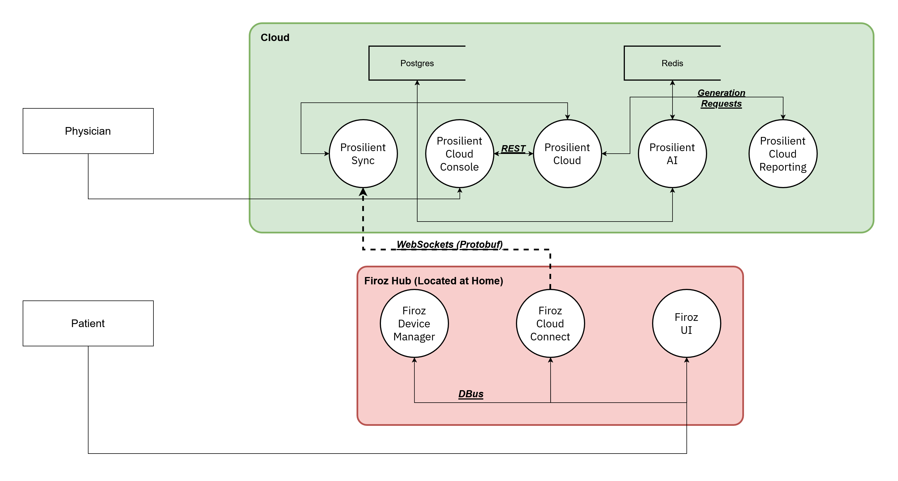

# Prosilient GeRI

This is a meta repository containing information, links, and resources about Prosilient Systems efforts behind the GeRI (Geriatric Remote Initiative).

The work produced is licensed under the MPL 2.0 to allow usage and adoption from academic organisations while ensuring the project is able to continually improve independently.

The GeRI is meant to enable a next generation of geriatrics patient-physician care by reducing the complexity of the data collection process. As a first step towards this goal, the Firoz platform was adopted. A selection of open source hardware and software components allows for collection of PRO (Patient Reported Outcomes) and sensor data.

For GeRI, a wrist worn wearable with accelerometry and a smart scale with bio impedance collection were used.

## Quick Links

* [Architecture](#architecture)
* [Data Flow](#data-flow)
* [Dependencies](#dependencies)
* [Hub](#hub)
* [Cloud](#cloud)
* [Common](#common)

## Acknowledgements
The Firoz services are named in memory of my late father, Firoz, who passed away after battling cancer twice and was the first software engineer in his family.

## Architecture

The Firoz platform is composed of the following components, some of which were modified for the GeRI. Each component is grouped into either the hub (patient use oriented) or the cloud (physician use oriented).

## Data Flow

Accessible Diagram Summary:

1. All services running at home on an embedded Firoz hub device; Firoz Device Manager, Firoz Cloud Connect, and Firoz UI communicate with each other via DBus.

2. The data aggregated by the hub is synchronised with the Prosilient Sync service running in the cloud. The hub device sends its data across a websocket, encoding the data in Protobuf binary messages. Each message is retained on the device until an acknowledgement is received from the Prosilient Sync Service.

3. All services, excluding Prosilient Cloud Console, run in the cloud. Prosilient Sync, Prosilient Cloud, Prosilient AI, and Prosilient Cloud Reporting use Postgres as their persistence layer. Redis is used to support pub sub style message queues between Prosilient Cloud, Prosilient AI, and Prosilient Cloud Reporting to allow long running report generation tasks to run and be reliably tracked in the background. Prosilient Cloud Console communicates directly with the Prosilient Cloud API via REST.

## Dependencies

* Firoz Services require an environment that supports **systemd** or at least **DBus**.
* Prosilient Cloud Services require **Postgres** and **Redis** to function.

## Hub

* Firoz Device Manager

  * Purpose: Sensor connection management and data collection service
  * Repository:
  * Technologies: Rust, BlueR, ZBus, RfKillr
  * Summary: Provide seamless sensor connection management while providing a coherent D-Bus API for native integration in Linux based systems. Connection, reconnection, and failure cases are handled gracefully to ensure a reliable connection and data transfer from devices. Its design goal is to provide an extensible API that is connectivity technology agnostic.

* Firoz Cloud Connect

  * Purpose: Provide patient with surveys they need to answer, synchronise collected data regarding PRO, sensor data, and adherence statistics. Ensure long term offline reliability.
  * Repository:
  * Technologies: Rust, ZBus, Tokio, Tungstenite, Protobuf, SQLx (SQLite)
  * Summary: An offline first approach to syncing, built on top of websockets to allow reliable device connection status and better reliability in unreliable networks. Also built on top of a robust D-Bus API to provide seamless integration in Linux based systems. Data is backed by SQLite for reliable persistence. Per instance asymmetric key provisioning allows for secure long term use with multiple users via credential resets.

* Firoz UI

  * Purpose: A multiplatform Flutter based UI that presents information from both Cloud Connect and Connectivity Manager
  * Repository:
  * Technologies: Flutter, Dart, Flutter E-Linux, DBus
  * Summary: Achieving the highest System Usability Score in UChicago for a patient oriented user interface, Firoz UI is built with technologies that allow for dynamic adoption and use on a variety of platforms. Its architecture allows for seamless deployment on Linux platforms via Flutter E-Linux and empowers developers to build use cases through the DBus API.

* Firoz Remote Support

  * Purpose: Provide moderated support access to the tablet for diagnosing issues.
  * Repository:
  * Technologies: Rust, RatHole
  * Summary: A simple service that uses the same authentication mechanism from Cloud Connect to allow technicians to access the devices of consented users via SSH.

* Firoz Bangle

  * Purpose: Bangle JS firmware for GeRI spec accelerometer data collection.
  * Repository:
  * Technologies: JavaScript (Bangle spec)
  * Summary: GeRI requires 48 hours of accelerometry data collection. This is specialised for fast reconnection, efficient compression, and storage of accelerometry data, stretching the hardware limitations of the BangleJS to its absolute limits.

## Cloud

* Prosilient Sync

  * Purpose: Authenticate Firoz devices and synchronise their local data. Primarily ingress.
  * Repository:
  * Technologies: Rust
  * Summary: Supports authenticating devices with the cloud through passwordless authentication, followed by ingress only permissions for secure data collection from Firoz devices. Ensures reliable message deliveries and reconnections.

* Prosilient Cloud

  * Purpose: Primary API layer for read only access to collected data.
  * Repository:
  * Technologies: Python
  * Summary: Network limited read only access over the entirety of patient data with valuable statistics and metadata for relevant exploration and reporting support.

* Prosilient Cloud Console

  * Purpose: Dashboard for physicians to monitor patients and explore data with report generation.
  * Repository:
  * Technologies: Svelte
  * Summary: An intuitive dashboard primarily for physician use allows them to review adherence from patients along with data collection metrics and device status and availability.

* Prosilient Cloud Reporting

  * Purpose: Generate reports requested by physicians
  * Repository:
  * Technologies: Python
  * Summary: Data aggregation and CSV report generator.

* Prosilient AI

  * Purpose: Run different AI models
  * Repository:
  * Technologies: Python
  * Summary: Accelerometry data needs to be converted into multiple different metrics, like activity. This service facilitates that by hosting multiple models and running the requested data through those models.

## Common

* Prosilient Protobuf

  * Purpose: A collection of protobuf DTOs used for communication between Firoz Cloud Connect and Prosilient Sync.
  * Repository:
